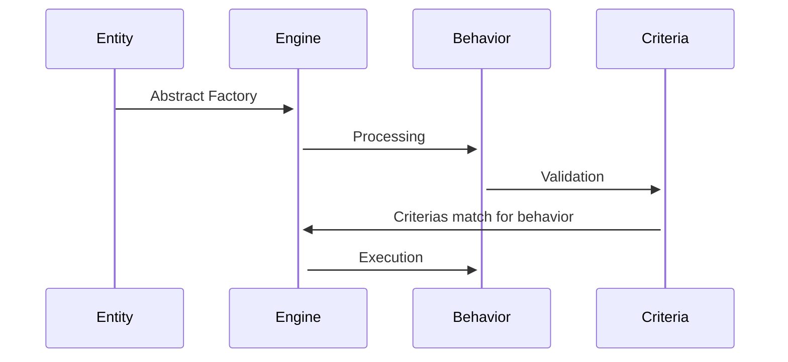

# Generic Behaviors Playground

Entities

Tick

IHM -> Fetch tick (TASK) -> Pass into Business Engine -> Fetch Behavior -> Log(N,nE) -> Match Criteria -> Engine return results

Scoped Task -> Business Engine -> 

Engine Result

If scope, apply any rule associated
If no scope, use criteria for dynamic trigger