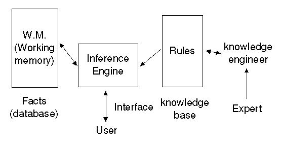

# Production Rule System Playground

## Concepts

### Expert System

As expert systems moved from research prototypes to deployed systems there was more focus on issues such as speed and robustness.

- https://en.wikibooks.org/wiki/Expert_Systems

#### Knowledge Based System

A knowledge-based system (KBS) is a form of artificial intelligence (AI) that aims to capture the **knowledge of human experts** to support **decision-making**. Examples of knowledge-based systems include expert systems, which are so called because of their reliance on human expertise.

- https://en.wikipedia.org/wiki/Knowledge-based_systems

#### Rule Based System

A classic example of a rule-based system is the domain-specific expert system that uses rules to make **deductions or choices**. For example, an expert system might help a doctor choose the correct diagnosis based on a cluster of symptoms, or select tactical moves to play a game.

- https://en.wikipedia.org/wiki/Rule-based_system

### Inference Engine

The inference engine, allows new knowledge to be inferred. 

- http://www.cse.unsw.edu.au/~cs9416/01-Overview/overview.html
- https://en.wikipedia.org/wiki/Inference_engine

### Proposional Logic / Propositional Calculus

- https://iep.utm.edu/prop-log/
- https://discrete.openmathbooks.org/dmoi2/sec_propositional.html
- https://brilliant.org/wiki/propositional-logic/ <3

## Definitions

- Inference Engine
- **Semantic Reasoner** : A semantic reasoner, reasoning engine, rules engine, or simply a reasoner, is a piece of software able to infer logical consequences from a set of asserted facts or axioms (https://en.wikipedia.org/wiki/Semantic_reasoner)
- Inductive Inference/Reasoning
- Forward Chaining
- Backward Chaining
- Truth Table

## Books

- Geometric and Topological Inference
