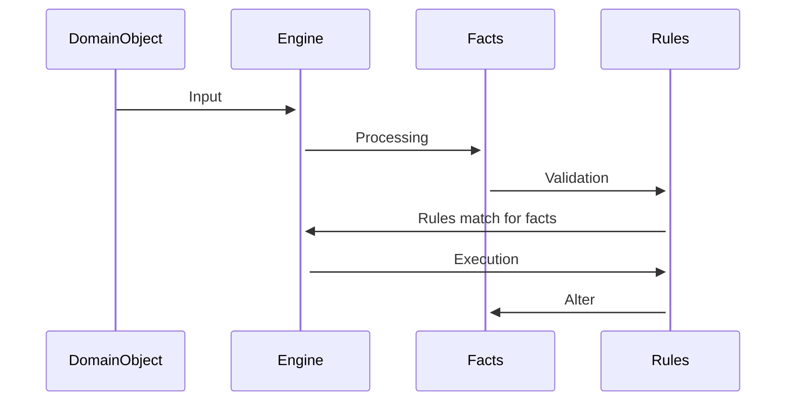

# Production Rule System Playground

## Concepts

### Expert System

- https://en.wikibooks.org/wiki/Expert_Systems

### Inference Engine

- http://www.cse.unsw.edu.au/~cs9416/01-Overview/overview.html

### Proposional Logic / Propositional Calculus

- https://iep.utm.edu/prop-log/
- https://discrete.openmathbooks.org/dmoi2/sec_propositional.html
- https://brilliant.org/wiki/propositional-logic/ <3

## Definitions

- Forward Chaining
- Backward Chaining
- Truth Table
